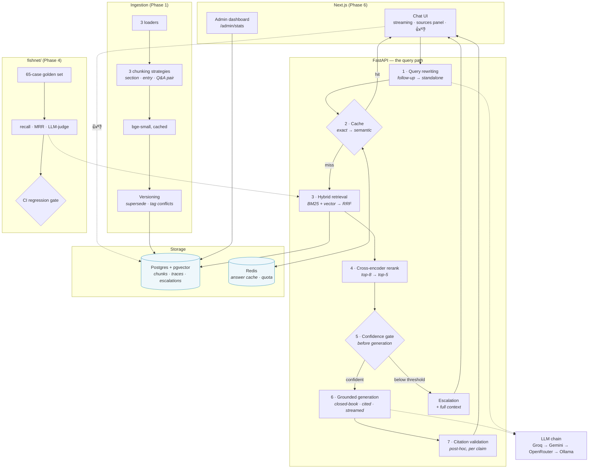

# Fishack 🎣

**Fishack fishes out the exact answer from a sea of docs — no fishy answers: every claim is cited, verified, and confidence-gated; when Fishack isn't sure, it escalates to a human instead of hallucinating.**

A multi-tenant RAG customer support assistant for "Flowlytics", a fictional B2B analytics and billing SaaS. Built raw — **no LangChain, no LlamaIndex** — on FastAPI, Postgres + pgvector, Redis, local embedding and reranker models, and free-tier LLM APIs behind an automatic multi-provider fallback chain.

---

## Demo

<!-- DEMO GIF PLACEHOLDER
     Frames worth capturing, in order:
       1. sources panel populating BEFORE the first token
       2. the planted stale-data conflict — two sources, one flagged "superseded in part"
       3. an out-of-scope question abstaining with zero LLM calls
       4. clicking [2] to reveal the chunk + the validator's per-claim verdict
       5. /admin — latency per stage, cost per query, cache hit rate
-->

> **GIF not recorded yet.** The five queries under [Try it](#try-it) walk the
> same path in about three minutes, and each one is labelled with what it is
> proving. Drop `demo.gif` in and replace this block.

---

## Architecture



**Tenant isolation runs through all of it.** Every database read goes through a
`TenantScope` that owns the `FROM` clause and welds on
`WHERE tenant_id = $1 AND is_current`; every cache key is namespaced by tenant.
Backed by construction-time guards, a runtime tripwire, a source-lint test, and
a CI leakage test with controls that stop it passing vacuously.

Every threshold and knob carries its provenance in a comment where it is
defined — `app/config.py` is the single place they all live.

---

## Results

Measured on the 65-case golden set across both tenants, via `make eval-retrieval`.
Retrieval-only, so no LLM calls and fully reproducible.

### Retrieval strategies

| arm | recall@5 | recall@20 | MRR | mean latency |
|---|---|---|---|---|
| BM25 only | 0.747 | 0.928 | 0.677 | 10 ms |
| Vector only | **0.938** | **1.000** | 0.820 | 40 ms |
| BM25 + vector (RRF) | 0.910 | 0.982 | 0.768 | 50 ms |
| BM25 + vector + reranker | 0.895 | 0.982 | 0.863 | 1,700 ms |
| **Vector + reranker** | 0.915 | **1.000** | **0.893** | 3,300 ms |

**Hybrid retrieval did not beat vector-only on this corpus** — and that is the
most useful thing the eval harness produced. Per question type, MRR:

| question type | BM25 | vector | hybrid |
|---|---|---|---|
| exact identifiers (`ERR_TIMEOUT_502`) | 0.542 | 0.652 | **0.726** |
| multi-turn follow-ups | 0.159 | **0.625** | 0.306 |

BM25 helps exactly where Design.md §5 predicts and is near-useless on short
pronoun-heavy follow-ups. Equal-weight RRF lets the harm win the average.

The sharpest single case: on *"how long until my events show up in the
dashboard?"* the correct chunk sat at **rank 7** under vector search and
**rank 20** after fusion. Only the top 8 candidates reach the reranker, so
blending pushed the right answer **out of the reranker's reach** — the vector
arm recovered it, the hybrid arm could not.

> **Caveat that matters.** This corpus is AI-written prose: smooth and
> semantically easy. Real documentation full of internal jargon and codenames
> would favour BM25 considerably more. This is a result about *this corpus*,
> not about retrieval in general.

### Chunking: per-source vs naive fixed-size

Same corpus ingested twice — once with the three per-source chunkers, once with
fixed 1,600-character windows — under shadow tenants, scored identically.
`make chunking-experiment`.

| question type | metric | naive | per-source |
|---|---|---|---|
| **overall** | recall@5 | 0.591 | **0.858** |
| | recall@20 | 0.863 | **0.972** |
| exact identifiers | recall@5 | 0.667 | **1.000** |
| | MRR | 0.450 | **0.726** |
| multi-turn | recall@20 | 0.550 | **1.000** |

Naive chunking loses **45% of multi-turn answers entirely** — not just ranked
lower, absent from the top 20. It cuts a ticket's question away from its
resolution and strips the heading context that tells a chunk what it is about.

> **Measurement caveat, stated because it cuts both ways.** Naive chunks carry
> no heading, so a docs locator resolves to a whole page there versus one
> section in the smart arm. A larger expected set *depresses* recall and
> *inflates* precision and MRR for the naive arm. So the recall gap is somewhat
> overstated and the MRR gap understated. `hit@5` is immune to this and is now
> the experiment's headline metric.

### Latency and cost

| | retrieval only | + reranker | full answer |
|---|---|---|---|
| p50 | 29 ms | 1,548 ms | measured per run |
| p95 | 71 ms | 5,290 ms | measured per run |

**The cross-encoder costs more than the entire latency budget.** Mean 1.7–3.3s
on a 12-thread CPU, against Design.md's P95 < 3s target *for the whole
request*. Buying +0.073 MRR for +3.3 seconds is a real product decision, and
the numbers to make it are now on the table rather than in a hunch.

`# PRODUCTION NOTE:` on a GPU or a hosted reranker that is ~200ms and an
obvious yes. On this hardware it ships behind a flag with conditional
triggering.

Cost is tracked as **virtual cost** — what the same token usage *would* cost at
paid-API prices, since actual spend on free tiers is $0. Methodology and the
price table are in `app/config.py`; live figures are on `/admin`.

The harness lives in `fishnet/`. `fishnet/run.py` is the entry point and every
metric in `fishnet/metrics.py` is a pure function with the formula in its
docstring, so a scorecard can be checked by hand.

---

## Interesting problems I hit

Seven of them, each as *what I expected → what happened → why*. The common
thread: **the dangerous failures are the silent ones.** None of these crashed.
The full test suite was green the entire time.

**1. My keyword search returned zero rows, and nothing complained.**
Every convenient Postgres helper — `plainto_tsquery`, `websearch_to_tsquery` —
joins terms with `AND`. That is boolean retrieval; BM25 *sums* a per-term
contribution, so partial matches must still score. `"webhook retry limit
ERR_TIMEOUT_502"` matched nothing, because no single chunk held all six
lexemes. Hybrid retrieval silently became vector-only. Fixing it by OR-ing
everything then broke exact identifiers — `ERR_TIMEOUT_502` lexes to three
tokens, so any chunk containing `err` matched. The right answer distinguishes
`&` (concepts the user typed → OR) from `<->` (one identifier held together →
leave alone). Three versions of one line.

**2. My eval scored the wrong list, and made a working feature look useless.**
`hybrid` and `hybrid+rerank` produced byte-identical scorecards while the
reranker burned 1.4s per query. The eval was scoring `candidates` — the
*pre-rerank* list — because reranking returns a new list into `results` rather
than re-sorting in place. The obvious conclusion would have been "delete the
reranker". Once fixed it was worth +12% MRR overall and +33% on normal
questions.

**3. A test that guards against fake passes, which itself passed fakely.**
My tenant-isolation test plants a secret in tenant B and asserts tenant A never
sees it — with a *control* proving the secret is findable without the filter,
so the test can't pass on an empty index. The control counted matches across
the whole table, so the real corpus satisfied it while the test tenants matched
nothing at all.

**4. A threshold I never measured was wrong by 4x, in the direction that hid
the feature.** `0.30` sat in config with a confident comment. Real queries
produce 0.055–0.076, and the arithmetic caps it at 0.062 — so the gate could
never fire. A config value that *looks* tuned and does nothing.

**5. The same mistake, three times, in three places.** The scorecard averaged
three retrieval strategies into one row. The eval compared pre- and post-rerank
lists as if they were the same thing. The chunking experiment scored 8 cases in
one arm and 41 in the other and printed a delta anyway. All three: *a
comparison that wasn't comparing the same things*, presented as a confident
number. The fix wasn't more care — it was a guard at each comparison point that
checks validity before formatting.

**6. A semantic cache is the most dangerous component in a RAG system.**
`ERR_TIMEOUT_502` and `ERR_TIMEOUT_504` embed above a 0.95 similarity threshold
— they *mean* nearly the same thing — and have opposite answers. That is the
weakness hybrid retrieval exists to fix, except the cache is pure vector
similarity with no keyword leg and no reranker. So identifier-bearing queries
skip the semantic cache entirely. And abstentions are never cached: "I don't
know" is a fact about the corpus at one moment, and caching it makes the system
refuse documentation it now has.

**7. Instrumentation that lies when the feature works.** A cache hit is free —
so if it replayed the original answer's cost, cost-per-query would *rise* as
caching improved. The dashboard would show the system getting more expensive
exactly as it got cheaper, on the metric caching exists to improve.

---

## Quickstart

Three commands. Postgres, Redis, the API and the UI all come up together.

```bash
cp .env.example .env    # add a free Groq key — the rest are optional fallbacks
docker compose up -d --build
docker compose exec api python scripts/ingest.py run
```

Then open **http://localhost:3000** (chat) and **http://localhost:3000/admin**
(operations).

<details>
<summary>First run takes a few minutes — here's what's happening</summary>

The API container downloads `bge-small` and `bge-reranker-base` (~450 MB) at
startup, deliberately: paying it during boot means the first user gets a normal
response, and a missing model fails the deploy rather than the first customer.
Watch for it:

```bash
docker compose logs -f api      # wait for "Fishack up. LLM chain: ..."
```

Ingestion embeds ~312 chunks on CPU — roughly two minutes. It is idempotent, so
re-running is free.

The corpus itself is **committed** (ADR-008), including the LLM prose cache, so
a fresh clone reproduces the exact same documents with no API key. Regenerate
with `python scripts/generate_corpus.py` if you want to.

</details>

Deploying it somewhere? The whole stack runs free on Neon (Postgres +
pgvector), Upstash (Redis), a Docker host for the API and Vercel for the UI.
Budget ~1.5 GB of RAM with the reranker loaded, or set `RERANKER_ENABLED=false`
and drop to ~700 MB. **Set `ADMIN_TOKEN` before exposing it** — `/admin/stats`
is the one endpoint that reads across tenants.

<details>
<summary>Local development without Docker</summary>

```bash
docker compose up -d postgres redis
python -m venv .venv && .venv/Scripts/activate     # or source .venv/bin/activate
pip install -e ".[dev]"
python scripts/migrate.py && python scripts/ingest.py run
make api                                            # terminal 1
cd frontend && npm install && npm run dev           # terminal 2
```

</details>

### Try it

| query | what it demonstrates |
|---|---|
| *What is the webhook retry limit?* | the planted stale-data conflict — docs say 3, the v2.4 changelog says 5. Watch it prefer the newer source **and flag the discrepancy** |
| *What causes ERR_TIMEOUT_502?* | exact identifiers, where the keyword leg earns its place |
| *What is the capital of France?* | out of scope — abstains with **zero LLM calls**, and opens an escalation |
| *ask the same question twice* | the cache: `⚡ cached`, and total time drops to ~10 ms |
| *switch tenant, ask again* | isolation — different private documents, no leakage |

Run them in that order — each one turns on a defence the previous one didn't
need.

---

## Tooling

| command | what it does |
|---|---|
| `make test` | 369 tests + 23 integration |
| `make eval-retrieval` | retrieval scorecard, no LLM calls, under a minute |
| `make eval` | full harness incl. LLM-as-judge, vs the committed baseline |
| `make chunking-experiment` | naive vs per-source chunking, on shadow tenants |
| `make tune` | sweep the confidence gate against the golden set |
| `make playground` | BM25 / vector / hybrid / reranked, side by side |
| `make chat` | the pipeline in a terminal, every stage's decision visible |
| `make show-prompt` | the exact messages the model receives |
| `make triage` | classify 👎 into retrieval / generation / stale-data |

---

## Reading the code

There is no separate design document to keep in sync — the reasoning lives next
to the code it explains. Every module opens with a docstring saying why it
exists, and comments answer *why*, not *what*. A good order, bottom up:

| start here | because |
|---|---|
| [`Design.md`](Design.md) | the system design this implements |
| `app/retrieval/tenant_scope.py` | the isolation core — the only place `FROM chunks` may appear |
| `app/retrieval/bm25.py` | one line took three versions; the comment explains all three |
| `app/retrieval/fusion.py` | RRF as ~40 lines of pure function, fully unit-tested |
| `app/generation/pipeline.py` | the whole query path in one readable sequence |
| `app/generation/citations.py` | post-hoc validation, and an honest note on what it cannot catch |
| `app/cache/keys.py` | why identifier queries are banned from the semantic cache |
| `fishnet/run.py` | the eval harness entry point |

## Stack

Python 3.12 · FastAPI · Pydantic v2 · Postgres 16 + pgvector · Redis ·
`bge-small-en-v1.5` + `bge-reranker-base` (local, CPU) · Groq / Gemini /
OpenRouter / Ollama · Next.js App Router + Tailwind · pytest · Docker Compose

**No LangChain, no LlamaIndex, no vendor SDKs.** Every provider is raw `httpx`;
retrieval, fusion, reranking, prompting, citation validation, caching and
evaluation are all written out. That is the point — the interesting decisions
are the ones a framework would have made for you.
